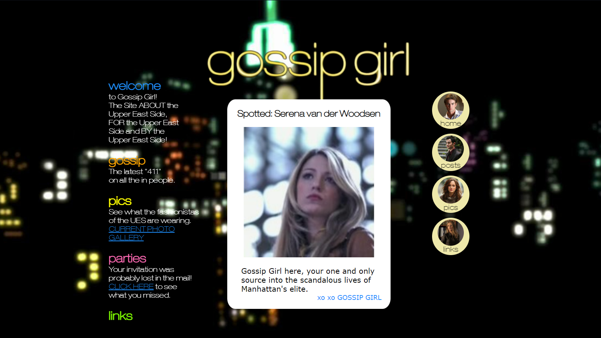

# Gossip Girl

## Description

This project is a simple one-page website that pays homage to the iconic Gossip Girl TV show. Inspired by the show's original website, circa 2007, this project serves as a fun and nostalgic practice in HTML and CSS. It's a non-functional showcase designed for those who share a love for the Upper East Side drama and the enigmatic Gossip Girl.

## Features

- **2007 Aesthetic**: Experience the web design style of the mid-2000s, with bold fonts, vibrant colors, and a touch of glamour.

- **Homepage Replica**: The webpage mirrors the homepage of the Gossip Girl website as seen in the TV series.

- **Static Content**: This project is a static website with no additional functionalities, keeping it true to the simple web landscape of the past.

## Deployment

The project is deployed and accessible online. You can visit the website at [https://nedzmijamuminovic.github.io/Gossip-Girl/](https://nedzmijamuminovic.github.io/Gossip-Girl/) to experience the nostalgia.

## Getting Started Locally

To view the website locally, follow these simple steps:

1. Clone the repository to your local machine using the following command:

    ```bash
    git clone https://github.com/NedzmijaMuminovic/Gossip-Girl
    ```

2. Navigate to the project directory:

    ```bash
    cd Gossip-Girl
    ```

3. Open the `index.html` file in your preferred web browser.

Now, you can enjoy the nostalgic vibes of the Gossip Girl website - because who can resist the allure of the Upper East Side? xoxo

## Screenshot


